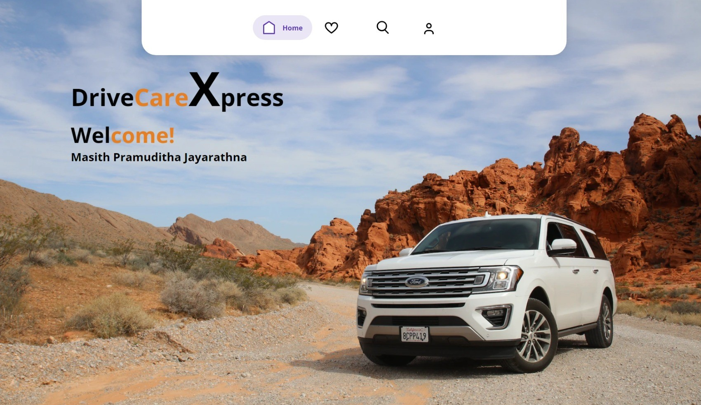

# DriveCareXpress

A traditional web application for vehicle service reservation with a focus on security, authentication, and access control.
This Web application is focused on mitigating the OWAPS top 10 vulnerabilities, mostly focusing on Broken Access Control, SQL Injection, and Cross-Site Scripting (XSS).
Also, user authentication and access control have been implemented using OIDC protocols with a cloud-based Identity Provider (IDP), Asgardeo.

## Roadmap to Deploy

- Download the project as a Zip

- Extract it to your workplace

- Open the project using an IDE that supports dynamic web application development such as Eclipse.

- Go to the src->main->webapp->WEB-INF->classes->application.properties and update with your credintials. (You must have an Asgardeo account with an application and at least one user)

- Check whether the required jars are available in the lib folder. (json-simple and mysql-connector jars). 

- If not download them and configure them to the project.

- Run the index.jsp as the entry point on the Tomcat server (If you are not familiar with the Tomcat server refer to the below YouTube tutorial for better understanding)

### Hope this will be helpful!!

## Reference

 - [You can find the Blog Article about DriveCareXpress](https://medium.com/@pramudithajayarathna/i-developed-a-traditional-web-application-using-asgardeo-authentication-2f943575504d)
 - [Tutorial for Tomcat Configuration](https://github.com/matiassingers/awesome-readme)
 - [Asgardeo console to make the Application and users](https://console.asgardeo.io/app)
 - [Asgardeo Docs for better understanding](https://www.youtube.com/watch?v=4ZmohlE3toQ)

